# 🐼Project Panda🐼
<br>

## 📃TABLE OF CONTENTS  
- [INTRODUCTION](#INTRO)🎉
- [DESCRIPTION OF OUR PROJECT](#DESCRIPTION)🎈
- [EXECUTION](#EXECUTION)💫
- [KEY_FEATURE](#KEY_FEATURE)🔑
- [EXAMPLE SENARIO](#EXAMPLE_SENARIO)
- [TECH STACK](#TECH_STACK)⚡️
- [TEAM MEMBERS](#TEAM_MEMBERS)🩵
<br>

## 🎍INTRO

2024년 1학기 중앙대학교 소프트웨어공학 코스 텀 프로젝트.🔥🔥      
이슈 관리 소프트웨어 ✨**Project Panda**✨ 입니다  
> Why is there a panda in the name?🤔 There's a sad story there...🥲  
> We couldn't get enough sleep😪 so we have dark circles as a result.👻  
> We are becoming more and more like pandas.🐼 Cheers.  
<br>

## 🎍DESCRIPTION

**프로젝트 판다** 는 소프트웨어 개발을 주 목적으로 하는 회사 등의 단체를 위한 이슈 관리 소프트웨어 입니다.  
이슈를 생성하거나 할당하는 것은 물론이고, 해당 이슈의 상태를 관리하고, 댓글 기능을 이용해 해당 이슈에 대해 조직 구성원들과 공유하는 등의 작업이 모두 가능합니다.  
이 뿐만 아니라 현재 이슈를 과거 이슈들과 비교하고, GPT API를 활용해 현재 이슈에 가장 어울리는 개발자를 추천해 주는 등 기존에 존재하는 이슈 관리 시스템과는 차별화되는 여러 기능을 통해 소프트웨어의 사용성을 높였습니다.  
<br>
**프로젝트 판다** 는 이슈 관리에 필요한 여러 기능을 API로 제공하고 있으므로, 해당 API를 활용해 여러 플랫폼에서 조직에 필요한 이슈 관리 프로그램을 개발할 수 있습니다.
<br>
-> [서버 저장소 깃허브 바로가기](https://github.com/Soft-Gallery/issue-management-backEnd.git)
<br><br>
**프로젝트 판다**에서 제공하고 있는 플랫폼은 웹, 모바일 앱(ios, androiod)으로 총 3가지 입니다.
소프트웨어를 앱에서 사용해보고 싶으신 분들은 아래의 깃허브 주소를 참고해주시기 바랍니다.
<br>
-> [모바일 어플리케이션 깃허브 바로가기](https://github.com/Soft-Gallery/issue-management-app.git)
<br>
<br>  

## 🎍EXECUTION

* **웹 링크** : http://18.205.75.48 <br><br>
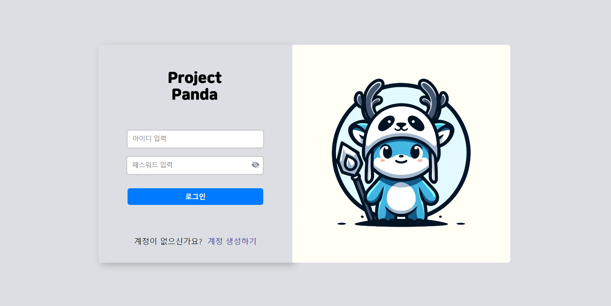

  
  [ 2024.06.03 기준 ] <br>
  웹사이트와 서버를 aws로 배포한 상태입니다.
  유동적인 배포 상태로 인하여 사이트가 올바르게 작동하지 않을 수 있으니, 문제가 발생할 경우 첨부된 이메일로 연락 주시면 최대한 빨리 해결해드리겠습니다:) 
  <br>
  sumin1667@cau.ac.kr

<br>

**⚠사용 전, 필독사항⚠**

- 'F5'를 사용하지 말아주세요!!<br>
'F5'를 누르면 자동 로그아웃되어 처음 로그인 페이지로 이동하게 되니 사용을 자제해주세요. 
- 로그인 페이지로 이동할 땐, url을 (/login)을 이용해주세요!!<br>
로그아웃 기능이 없어, url 조작을 통하여 로그인 페이지로 진입해야합니다.
- issue 상세보기 페이지에서 sidebar를 사용할 수 없으니, 반드시 '뒤로가기'를 누른 후, sidebar를 사용해주세요!!<br>
사용자의 role에 따라 최초 진입하게 되는 dashboard에서만 사이드바를 사용할 수 있습니다.

<br><br>

* **localhost**로 실행하는 법

> **Java 17 이상 및 JDK 17 이상**<br>
> **Node.js 14 및 npm 6 이상**<br>
> **WebStorm, VSCode 등 IDE** (선택 사항)
<br>
1. termianl에서 아래의 명령어를 실행하여 원격 레포지토리를 clone해주세요.<br><br>

```
git clone https://github.com/Soft-Gallery/issue-management-frontEnd.git
```

<br>
2. 서버 주소(http://3.230.242.105:8080)를 포함한 .env 파일을 루트 폴더 아래에 생성해주세요.<br><br>

```
REACT_APP_SERVER_URL=http://3.230.242.105:8080
```

<br>
3. terminal에서 아래의 명령어로 프로젝트에 필요한 package들을 설치해주세요.

**[node.js, npm 설치 필수]**
<br>
```
npm install
```

<br>
4. terminal에서 아래의 명령어를 실행하여 프로젝트를 실행해주세요.<br><br>

```
npm run start
```

<br>

## 🎍KEY_FEATURE

### 계정 생성  
  `ADMIN`, `DEVELOPER`, `TESTER`, `PL` 네가지 `ROLE`을 선택하여 계정을 생성하는 기능을 제공합니다. <br>
  사용자의 아이디, 패스워드 이름, 이메일 주소를 계정 생성 조건에 맞게 입력해주세요.

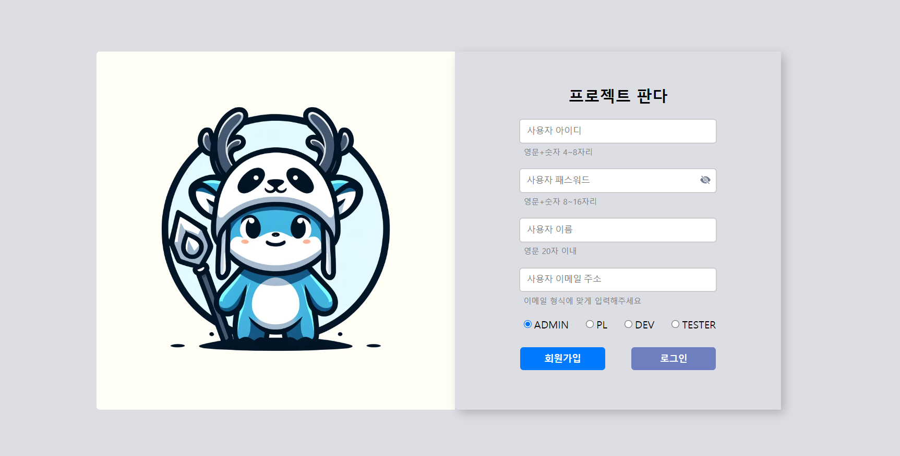

<br>

### 프로젝트 생성  
  `ADMIN`의 프로젝트 `생성` 기능을 제공합니다.<br>

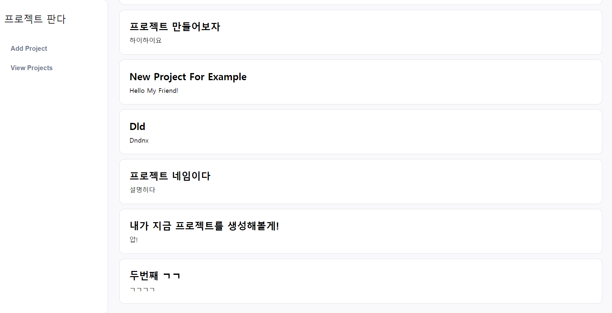
  `ADMIN`이 프로젝트를 `생성`하면서 해당 프로젝트에 `title`, `description`을 입력합니다. 이후, `TESTER`, `PL`, `DEVELOPER`를 프로젝트에 `추가` 할 수 있습니다.    


<br>

### 이슈 관리  
  이슈의 `생성`, `브라우징`, `상태 변경`, 등의 기능을 제공합니다.<br>
  `TESTER`가 이슈의 `title`, `description` 그리고 이슈 `comment`를 입력하여 이슈를 `생성`합니다.
  `PL`, `TESTER`, `DEVLOPER`'는 이슈를 보고하는 `reporter`, 이슈를 할당받는 `assignee`, 이슈를 해결하는 `fixer` 등 이슈에 대한 정보를 브라우징 할 수 있습니다.<br>   
  또한 서로 다른 `ROLE`을 가진 유저들의 상호작용을 통해 해당 이슈의 상태를 `NEW`, `ASSIGNED`, `FIXED`, `RESOLVED`, `CLOSED`, `REOPENED` 등으로 바꾸어 이슈의 상태를 관리 할 수 있습니다.

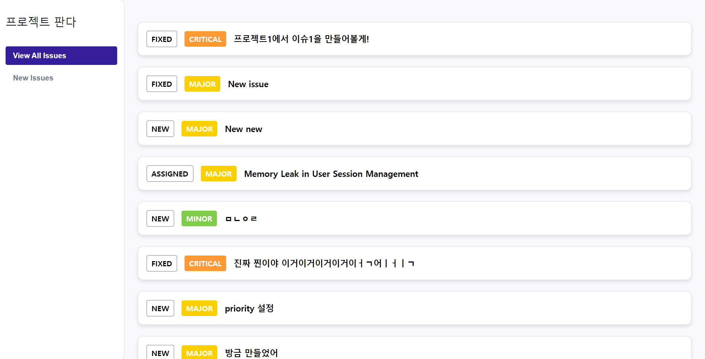

<br>

### 담당자 추천  
  `GPT API` 서비스를 이용해 현재 이슈에 가장 어울리는 `Assignee` 추천하는 기능을 제공합니다.<br>
  `PL`이 이슈에 개발자를 배정시킬 때 도움을 받을 수 있습니다.<br>  
  현재 이슈를 해결할 수 있는 이슈가 발생한 프로젝트에 속해 있는 개발자들의 과거 이슈 해결 내역 및 해당 이슈의 중요도 등의 정보와 더불어
  각 개발자들이 현재 수행중인 이슈들의 개수와 중요도 등을 다방면에서 평가하여 현재 이슈를 담당할 개발자를 추천합니다.<br>

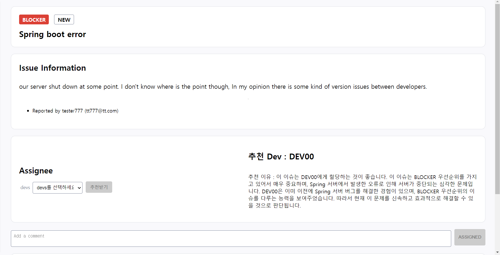

<br>  

### 코멘트  
  이슈에 달리는 `Comment`를 보여주는 기능을 제공합니다.  
  이슈의 상태가 변하는 상황을 포함해 필요한 여러 상황에 협업을 위한 `Comment`를 추가할 수 있습니다.    

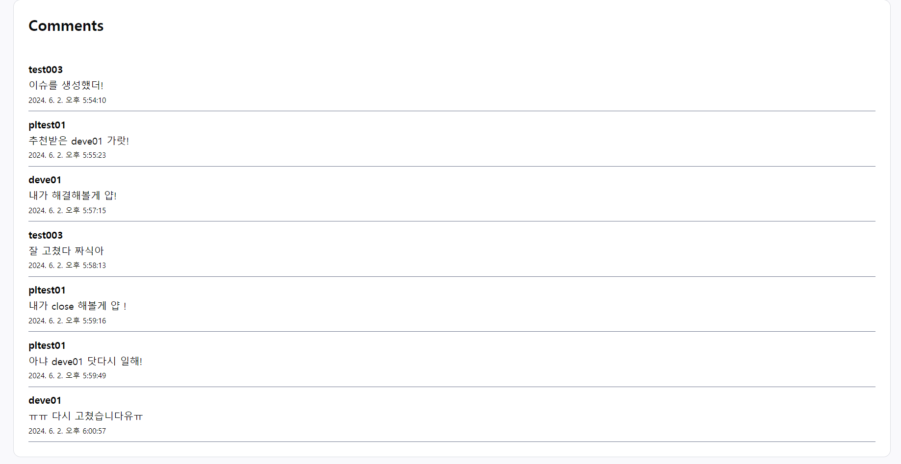

<br>

### 이슈 통계 분석  
  프로젝트의 `이슈`를 분석한 `시각적 통계 기능`을 제공합니다.  
  프로젝트 내부와 외부에서 수집한 이슈들의 정보와 `수치화 된 데이터`로부터 유의미한 자료를 시각적으로 보여줍니다.

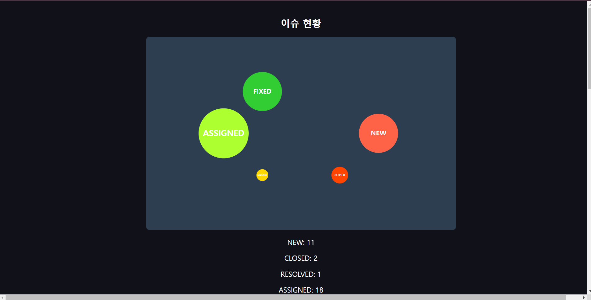

<br><br>

## 🎍USER_SENARIO

- `ADMIN` 프로젝트 생성 <br><br>

  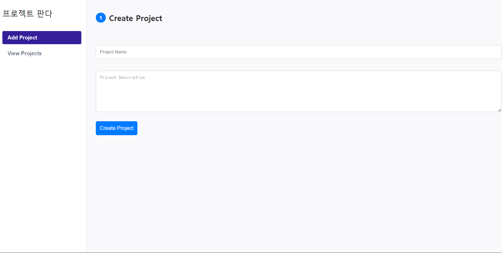
  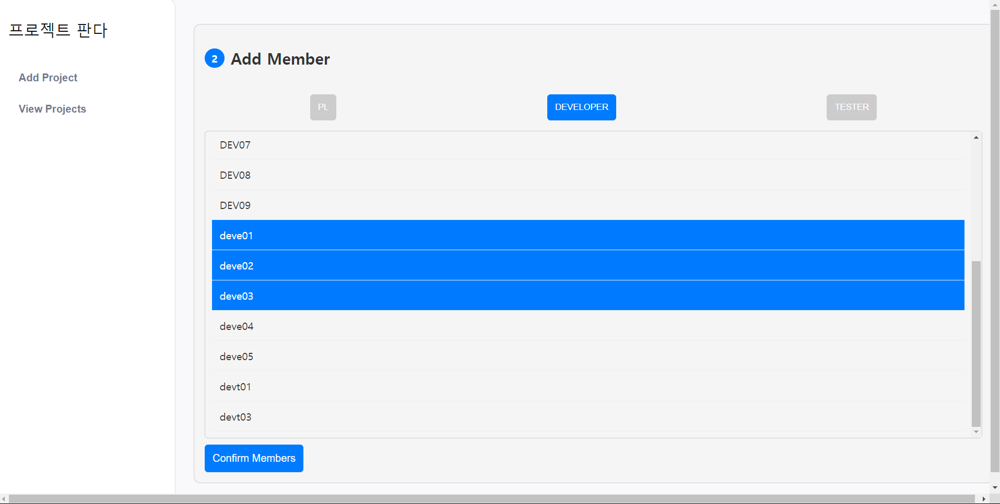

  `ADMIN`은 `project name`, `project description`을 입력하여 프로젝트를 생성하고 프로젝트에 `PL`, `TESTER`, `DEV`를 배정합니다. <br><br><br>


- `TESTER` 이슈 생성 및 브라우징 <br><br>
  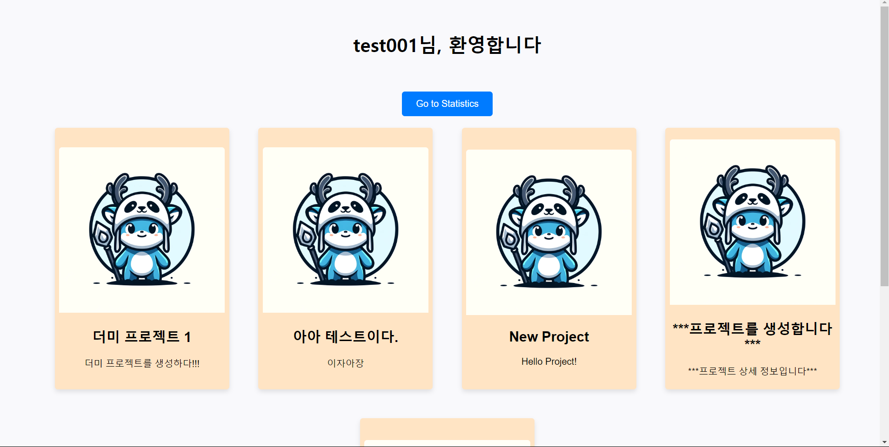

  `TESTER`는 프로젝트를 선택합니다. <br><br>

  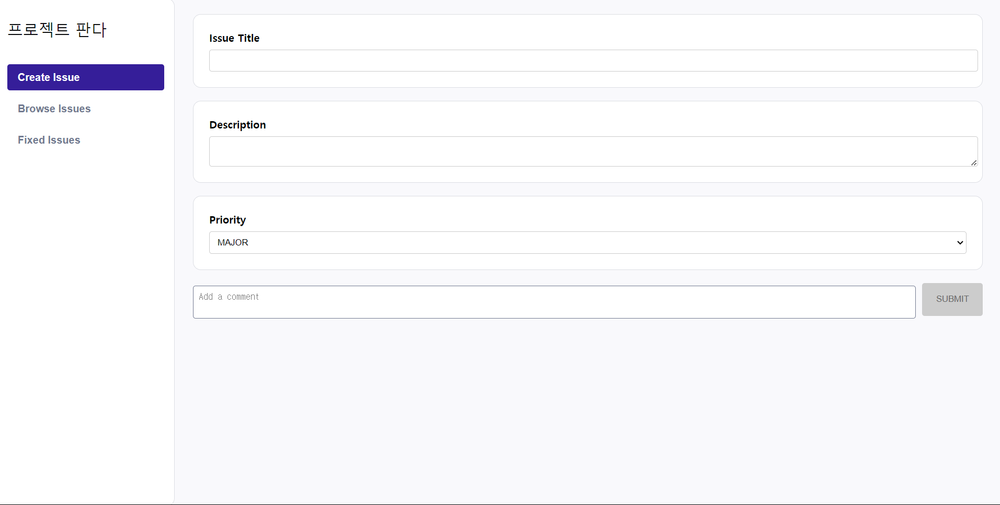

  `TESTER`는 이슈의 `title`, `description`을 입력하고 `comment`를 달아서 이슈를 생성합니다. <br><br><br>


- `PL`의 이슈 `담당자 지정` 및 이슈 상태 `NEW`에서 `ASSIGNED`로 변경<br><br>
  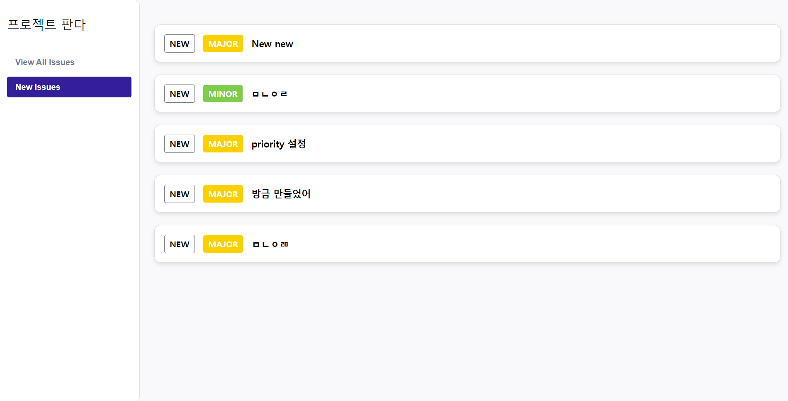

  `PL`은 `NEW` 상태의 이슈를 검색할 수 있습니다. <br><br>

  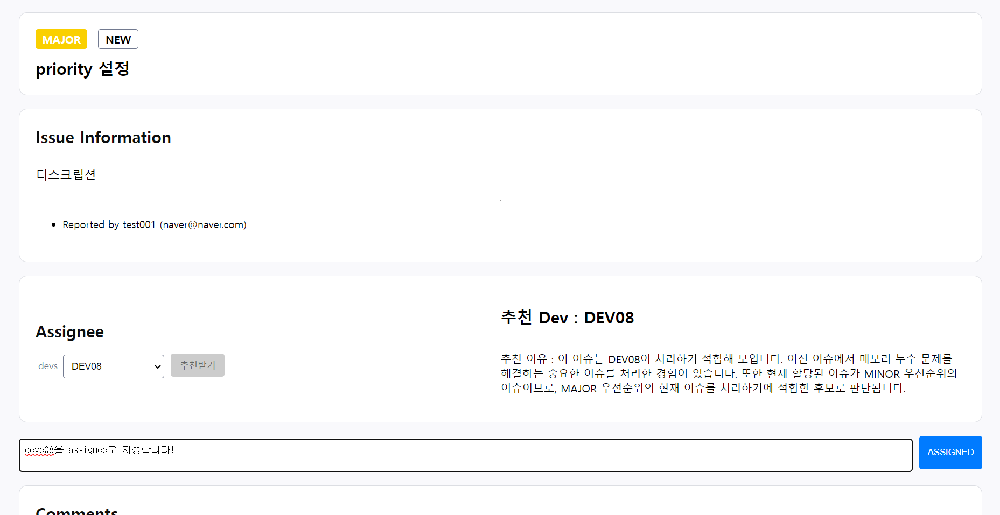
  `PL`은 이슈에 지정할 `담당자`를 `추천`받거나 직접 `선택`하고 코멘트를 작성합니다. <br><br>

  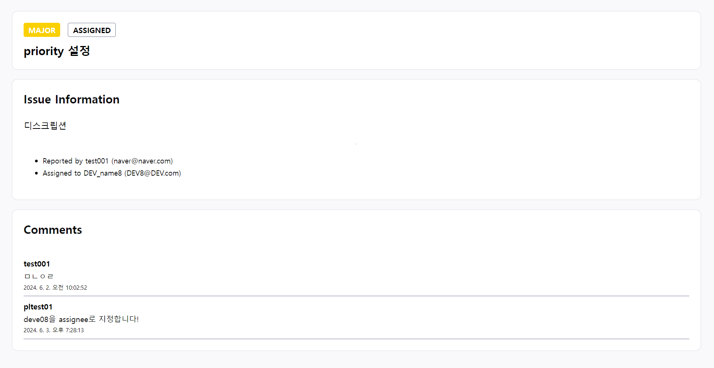
  `PL`은 이슈의 상태를 `NEW`에서 `ASSIGNED`로 변경합니다. <br><br><br>

- `DEV`는 자신에게 할당된 이슈 브라우징 및 이슈 상태 `ASSIGNED`에서 `FIXED`로 변경<br><br>

  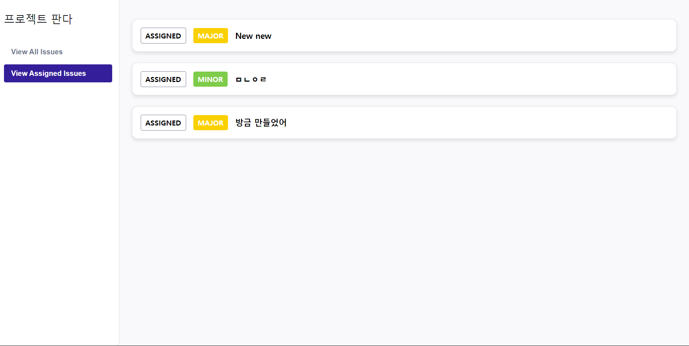
  `DEV`는 자신에게 배정된 이슈를 검색할 수 있습니다. <br><br>

  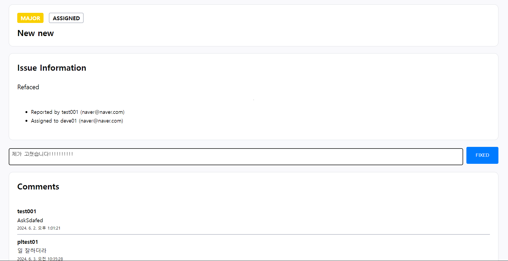
  `DEV`는 해당 이슈를 해결 한 후 이슈에 코멘트를 작성합니다. <br><br>

  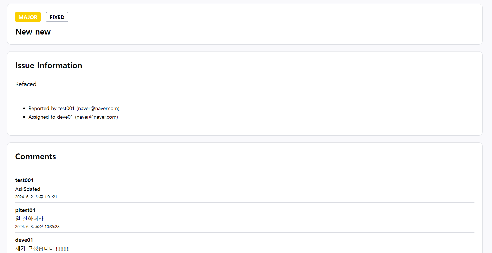
  `DEV`는 이슈의 상태를 `ASSIGNED`에서 `FIXED`로 변경합닌다. <br><br><br>
  
- `TESTER`가 자신이 report한 이슈의 상태를 `FIXED`에서 `RESOLVED`로 변경<br><br>

  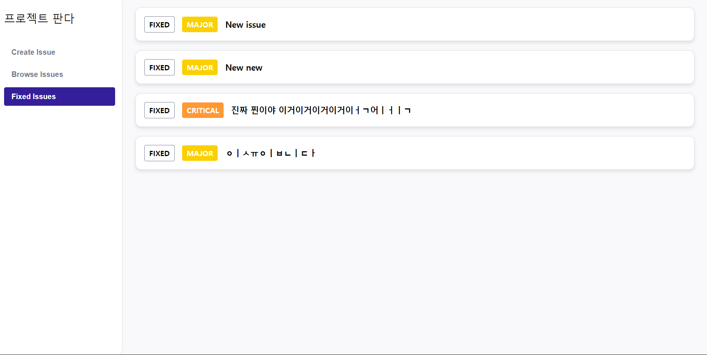
  `TESTER`는 자신이 report한 이슈 중 `FIXED` 상태인 이슈를 검색할 수 있습니다. <br><br>

  
  `TESTER`는 fix 된 이슈를 확인한 후, 이슈에 코멘트를 작성합니다. <br><br>

  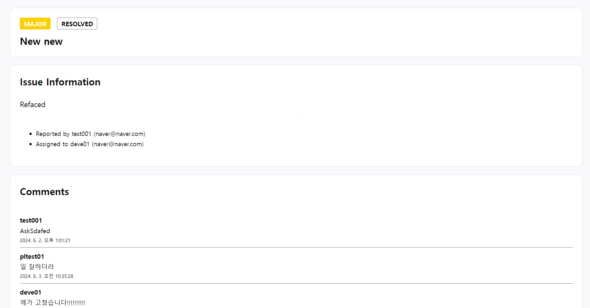
  `TESTER`는 이슈의 상태를 `FIXED`에서 `RESOLVED`로 변경합니다. <br><br><br>
  
- `PL`이 `RESOLVED` 이슈를 `CLOSED`로 변경<br><br>

  
  `PL`은 resolve 된 이슈를 확인한 후, 이슈에 코멘트를 작성합니다. <br><br>

  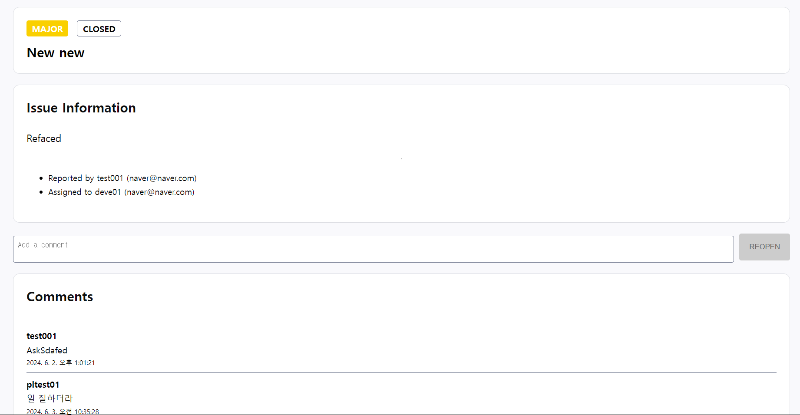
  `PL`는 이슈의 상태를 `RESOLVED`에서 `CLOSED`로 변경합니다. <br><br><br>
  
- PL이 `CLOSED`된 이슈를 다시 `REOPENED`로 변경<br><br>

  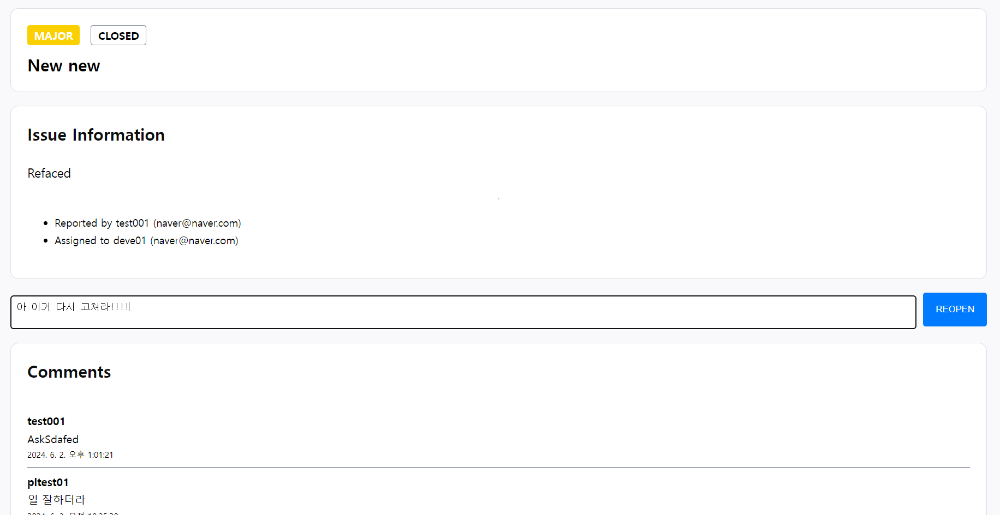
  `PL`은 close 된 이슈를 확인한 후, 이슈에 코멘트를 작성합니다. <br><br>

  
  `PL`는 이슈의 상태를 `CLOSED`에서 `REOPENED`로 변경합니다. <br><br><br>


## 🎍TECH_STACK
           
<br>

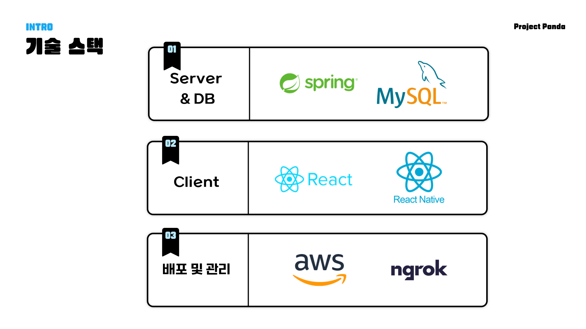  
<br>


## 🎍TEAM_MEMBERS
저희 팀을 소개합니다🤗

- **김선호**: **Back-End Dev**/중앙대학교 소프트웨어학부 20
- **김용우**: **Lead Mobile-App Dev**/중앙대학교 소프트웨어학부 20
- **김재훈**: **Back-End Dev**/중앙대학교 소프트웨어학부 20
- **박한결**: **Back-End Dev**/중앙대학교 소프트웨어학부 20
- **이수민**: **Lead Front-End Dev**/중앙대학교 소프트웨어학부 20  

<br>

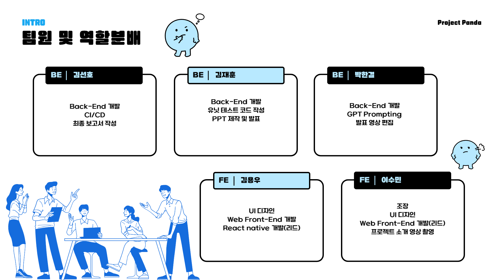
<br>
